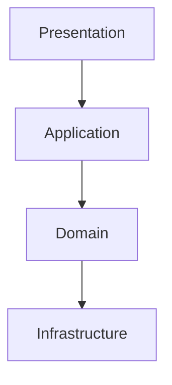

# Technical Architecture

The system follows a layered architecture with clear separation between domain logic and infrastructure. Communication between bounded contexts may occur via REST APIs or asynchronous messaging.

## Layers

1. **Presentation Layer**: Provides REST or GraphQL endpoints and user-facing interfaces.
2. **Application Layer**: Coordinates use cases and orchestrates domain services.
3. **Domain Layer**: Contains aggregates, entities, value objects, and domain services.
4. **Infrastructure Layer**: Deals with persistence, messaging, and integration with external systems such as the master bank or third-party services.

## High-Level Diagram

### Technology Suggestions

- **API Gateway**: Handle authentication, rate limiting, and routing to microservices
- **Database**: Use relational or NoSQL stores based on context needs
- **Event Bus**: Adopt a message broker for inter-context communication (e.g., RabbitMQ, Kafka)
- **CI/CD**: Implement automated testing and deployment pipelines
- **Containerization**: Use Docker/Kubernetes for scalable deployments

The architecture encourages modularity while enabling integration with existing banking systems and digital wallet features.

