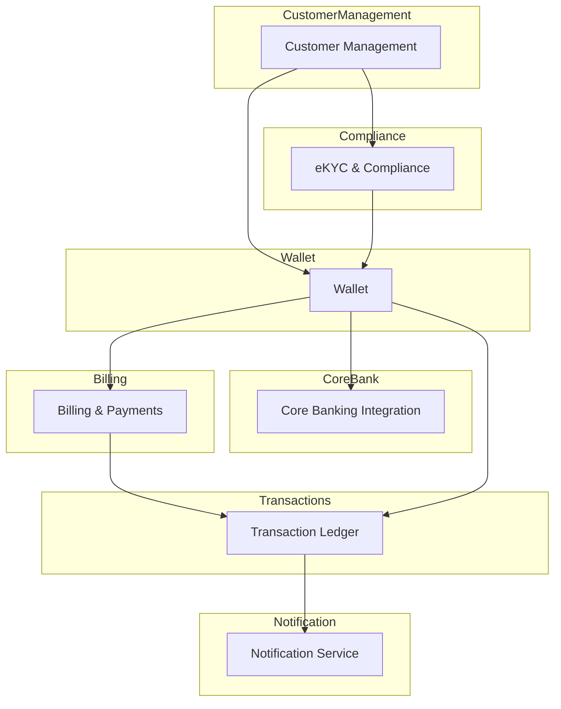

# Bounded Contexts

Bounded contexts define logical boundaries that separate different parts of the domain. Each context encapsulates its own model and ensures clear ownership of data and behavior.

## Overview Diagram

## Context Descriptions

### Customer Management
Handles user profiles, account settings, and customer onboarding. It collaborates with the eKYC context during registration and manages linked bank accounts.

### Wallet
Provides operations related to digital wallet balances, transfers, and top-ups. It interacts with the Transaction Ledger for persistence and with the Core Banking context for external transfers.

### Core Banking Integration
Responsible for communicating with the master bank. It manages bank account linking, fund transfers, and balance checks. External APIs are adapted here to conform to internal models.

### eKYC & Compliance
Ensures that regulatory requirements are met. The context stores verification records and exposes services for identity checks.

### Billing & Payments
Manages bills, recurring payments, and settlements. Payments can be triggered through the wallet or external bank transfers.

### Transaction Ledger
Stores the immutable history of all wallet and account transactions. Other contexts query this ledger for audit and reporting purposes.

### Notification Service
Sends messages to users about important events such as completed payments, account activity, or security alerts.

