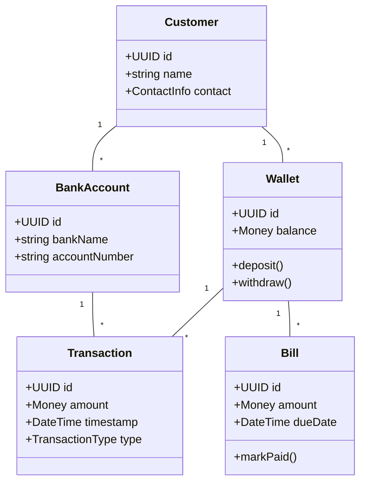

# Domain Model

The following diagram illustrates the primary entities and aggregates in the digital banking system. It serves as a conceptual view of how data is organized across bounded contexts.

## Entities and Aggregates

- **Customer**: The root aggregate for user information and linked bank accounts.
- **Wallet**: Manages funds for quick transfers and payments. Connected to transactions and bills.
- **BankAccount**: Represents external bank details used for settlement and top-ups.
- **Transaction**: Immutable record of a wallet or bank operation.
- **Bill**: Represents a payable invoice that can be linked to a wallet transaction.

Each aggregate is managed by a corresponding repository. Business rules are encapsulated within domain services where necessary.

