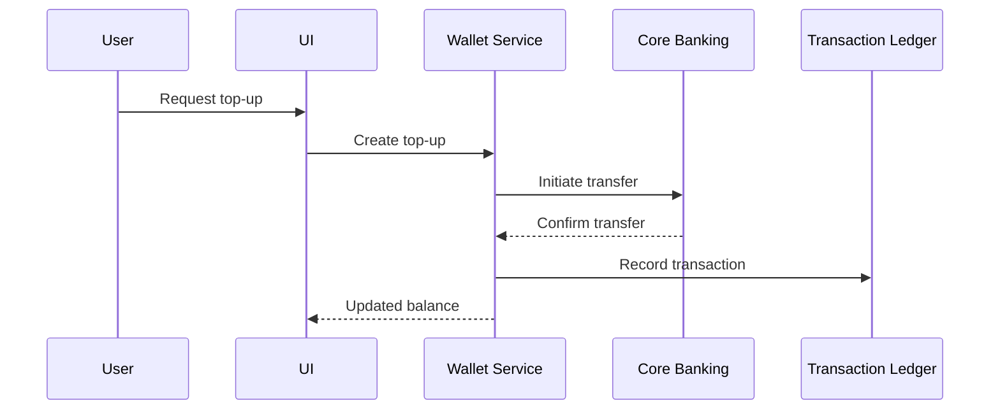

# Technical Design Document

This document describes the architecture and internal design of the digital banking system. It builds on the Domain-Driven Design approach outlined in this repository.

## Overview
- Modular architecture with Presentation, Application, Domain, and Infrastructure layers.
- Bounded contexts communicate via REST APIs or asynchronous messaging.
## Bounded Contexts
- Customer Management
- Wallet
- Billing
- Core Banking Integration
- Transaction Ledger
- Notification Service

## Technology Stack
- **API Gateway** for request routing and authentication.
- **Microservices** deployed in containers (Docker/Kubernetes).
- **Relational database** for customer and billing data; **NoSQL** store for transactions if high write throughput is required.
- **Message broker** (e.g., RabbitMQ or Kafka) for event-driven communication between contexts.
- **CI/CD pipeline** automating tests and deployments.

## Integration Interfaces
- External bank APIs used for balance checks and fund transfers.
- eKYC providers integrated via secure REST endpoints.
- Notification channels (email, SMS, push) abstracted behind a notification service.

## Data Model
The domain model follows aggregates shown in `domain-model.md`:
- `Customer` aggregate roots user data and linked `BankAccount` objects.
- `Wallet` manages available funds and references `Transaction` and `Bill` entities.
- The `Transaction` entity records immutable financial events.
## Component Design
Each bounded context is implemented as an independent service exposing a REST API. Services interact via the message broker and persist data in their own storage. The API gateway routes requests to the appropriate service and handles cross-cutting concerns such as authentication.

## Sequence Flows
Key interactions are detailed in `use-cases.md`. The following illustrates a wallet top-up:

## Security Considerations
- OAuth2 or similar mechanism for user authentication.
- Role-based access controls within each context.
- All communication secured via TLS.

## Deployment
- Services are containerized and orchestrated by Kubernetes.
- Persistent data stores are replicated and regularly backed up.
- Monitoring and logging tools capture metrics and system events for operational visibility.
## Development Workflow
- Source code managed in Git with feature branches and pull requests.
- Automated tests run in CI for every commit.
- Successful builds are deployed to staging before production release.

See `functional-requirements.md` for the business capabilities driving this design.
