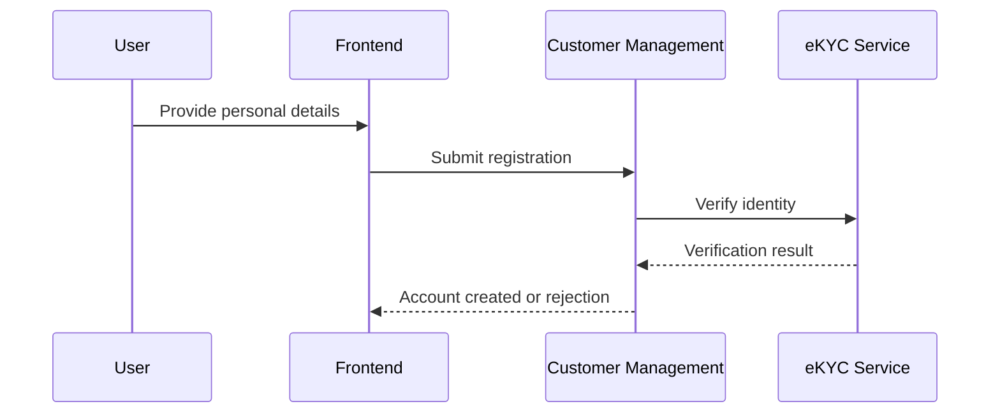
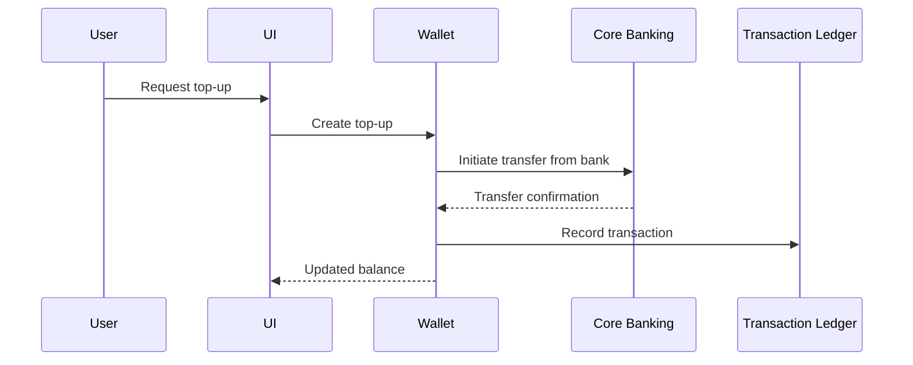
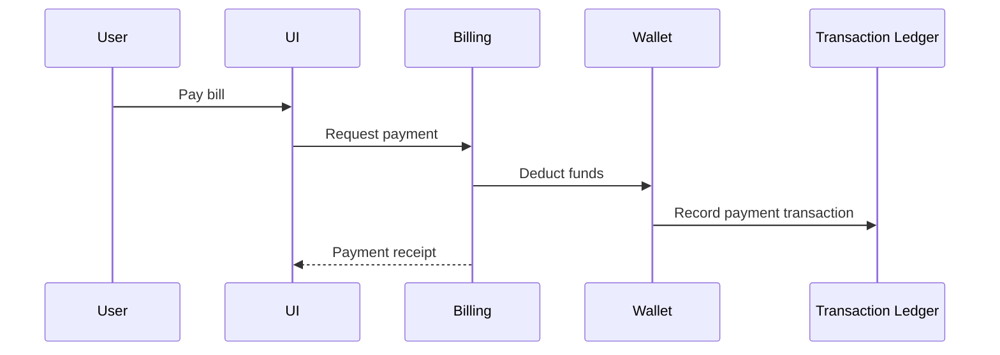

# Core Use Cases

This section summarizes key user journeys in the system. Each flow is implemented within the appropriate bounded context and can involve multiple aggregates.

## 1. Customer Onboarding and eKYC

## 2. Wallet Top-Up from Bank Account

## 3. Bill Payment Using Wallet

These use cases demonstrate how bounded contexts collaborate through services and events. Additional flows (such as recurring payments, notifications, or reporting) can be designed similarly.

